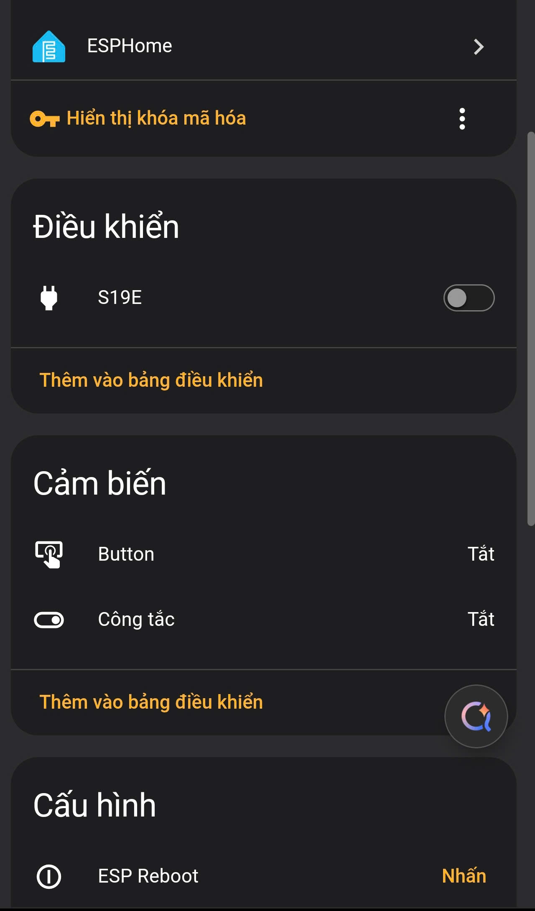
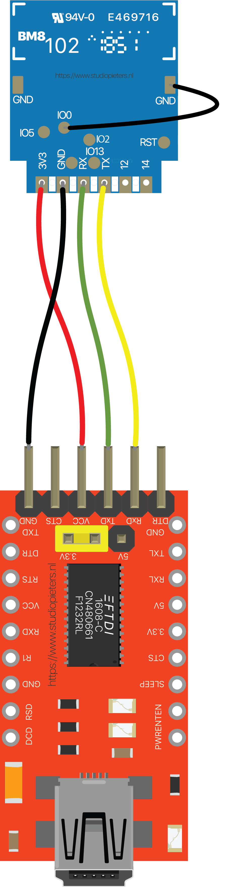
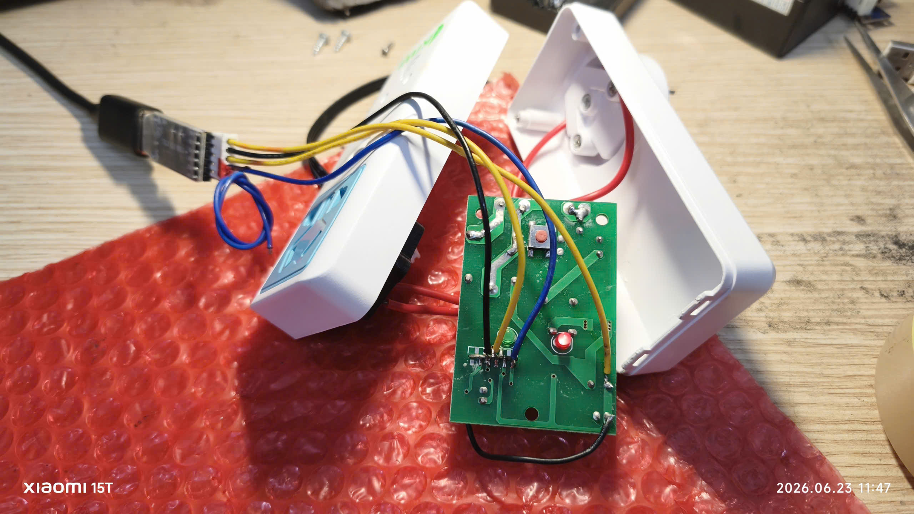
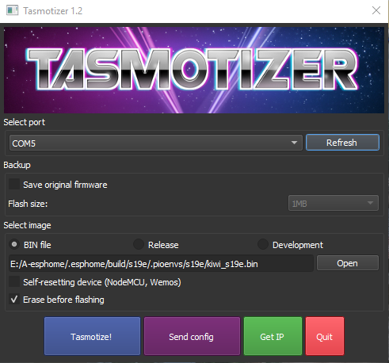

# Kiwi S19E ESPHome

ESPHome firmware for Kiwi S19E WiFi Smart Socket.

## Features

- Relay control
- Physical switch
- Factory reset button
- WiFi fallback AP
- Home Assistant API

## Hardware

Mạch ổ cắm thông minh Kiwi S19E sử dụng module **TYWE2S** (chạy chip ESP8285).

| Component | GPIO | Chi tiết |
|------------|-------| --- |
| **Relay** | GPIO12 | Điều khiển bật/tắt nguồn ổ cắm |
| **Switch** | GPIO5 | Công tắc phụ/Cảm biến trạng thái |
| **Button** | GPIO13 | Nút nhấn vật lý trên thân ổ cắm |
| **LED** | GPIO4 | Đèn LED báo trạng thái |

---

## Giao diện Home Assistant Dashboard

Sau khi nạp thành công và tích hợp qua ESPHome, thiết bị sẽ hiển thị đầy đủ các thực thể điều khiển và cảm biến như hình dưới:



---

## Hướng dẫn đấu nối và nạp Firmware (Flashing Guide)

Để nạp firmware ESPHome lần đầu cho module **TYWE2S**, bạn cần sử dụng một mạch chuyển đổi **USB-to-UART (FTDI/CH340)** có điện áp đầu ra là **3.3V**. 

## > ⚠️ **QUAN TRỌNG:** Tuyệt đối KHÔNG cắm ổ cắm vào nguồn điện 220V trong suốt quá trình câu dây và nạp phần mềm. Chỉ cấp nguồn qua mạch FTDI, USB to TTL (3.3V).

### 1. Sơ đồ đấu nối chân (Pinout)

Kết nối các chân từ module TYWE2S sang mạch nạp USB-to-UART theo sơ đồ sau:

| Module TYWE2S | Mạch nạp FTDI / UART | Ghi chú |
| :--- | :--- | :--- |
| **3V3** | 3.3V | Cấp nguồn (Không dùng 5V) |
| **GND** | GND | Chân tiếp địa chung |
| **TX** | RXD | Chân truyền tín hiệu |
| **RX** | TXD | Chân nhận tín hiệu |
| **IO0** | GND | **Nối tắt vào GND trước khi cấp nguồn** để vào chế độ Flash (Flash Mode) |



### 2. Hình ảnh câu dây thực tế

Hình ảnh hàn dây thực tế từ mạch nạp USB UART vào bo mạch của ổ cắm Kiwi S19E:



---

## Installation

Bạn có thể lựa chọn một trong hai cách dưới đây để nạp firmware cho thiết bị:

### Cách 1: Nạp file Firmware đã biên dịch sẵn (Nhanh nhất)
Nếu không muốn cài đặt môi trường ESPHome, bạn có thể flash trực tiếp file `.bin` đã được build sẵn trong kho lưu trữ này:

1. Tải file firmware tại đường dẫn: `firmware/kiwi_s19e.bin`
2. Sử dụng các công cụ nạp phần mềm phổ biến như **ESPHome Web Tools** (trên trình duyệt Chrome/Edge), **ESPTOOL**, ở đây mình sử dụng **Tasmotizer**.



4. Đưa module vào chế độ Flash (nối tắt `IO0` xuống `GND` trước khi cấp nguồn) và tiến hành nạp file `.bin`.
5. **Cấu hình WiFi sau khi nạp:** 
   * Rút dây nối tắt `IO0`- ngắt toàn bộ dây kết nối TTL lắp lại vỏ và cấp điện nguồn cho ổ cắm.
   * Thiết bị sẽ tự động phát ra một mạng WiFi tạm thời để bạn cấu hình. dùng điện thoại hoặc máy tính kết nối vào mạng WiFi này với thông tin sau:
     * **SSID:** `S19E-Kiwi`
     * **Password:** `888888889`
   * Sau khi kết nối thành công, một trang web sẽ tự động hiển thị (hoặc bạn truy cập địa chỉ `192.168.4.1`) để bạn nhập tên và mật khẩu WiFi nhà mình.

### Cách 2: Tự biên dịch bằng ESPHome (Tùy biến cấu hình)
Sử dụng cách này nếu bạn muốn chỉnh sửa nâng cao hoặc thay đổi thông số mặc định:

1. Cài đặt môi trường **ESPHome** trên máy tính hoặc sử dụng Add-on trên Home Assistant.
2. Sao chép file `secrets.example.yaml` thành `secrets.yaml` và cấu hình thông tin WiFi của bạn.
3. Đưa module vào chế độ Flash.
4. Tiến hành biên dịch và nạp trực tiếp bằng lệnh:
   ```bash
   esphome run kiwi_s19e.yaml
